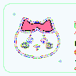
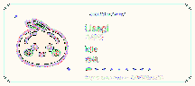
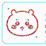

  
  
  
  

### 🌙 招呼一下

嗨嗨～欢迎来到 **玖玖奇妙 workspace** 💭

平常更常是深夜一个人胡思乱想，而不是 coding。  
但还是希望能和大家一起成长，做彼此的 **co-learner** 🌱

✨ 一起慢慢变好，一起把想法一点点落地吧～

---

### 🍡 Tech Stack

**Frontend · Vue**

**Backend · Spring / SSM**

**Agent · LangChain / LangGraph**

---

### 🍃 Motto

> 悟已往之不谏，知来者之可追

> 希望能够成为自己想要成为的样子 🌸

  
  
  

---

### 💌 Contact me

 
 

<picture>
  <source media="(prefers-color-scheme: dark)" srcset="https://raw.githubusercontent.com/1996ysh/1996ysh/output/github-contribution-grid-snake-dark.svg">
  <source media="(prefers-color-scheme: light)" srcset="https://raw.githubusercontent.com/1996ysh/1996ysh/output/github-contribution-grid-snake.svg">
  
</picture>

